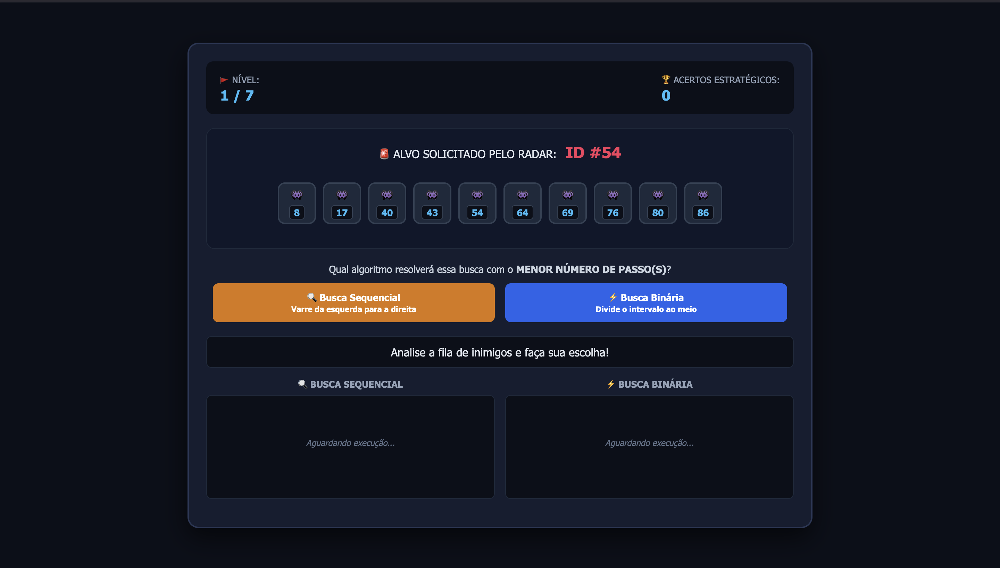
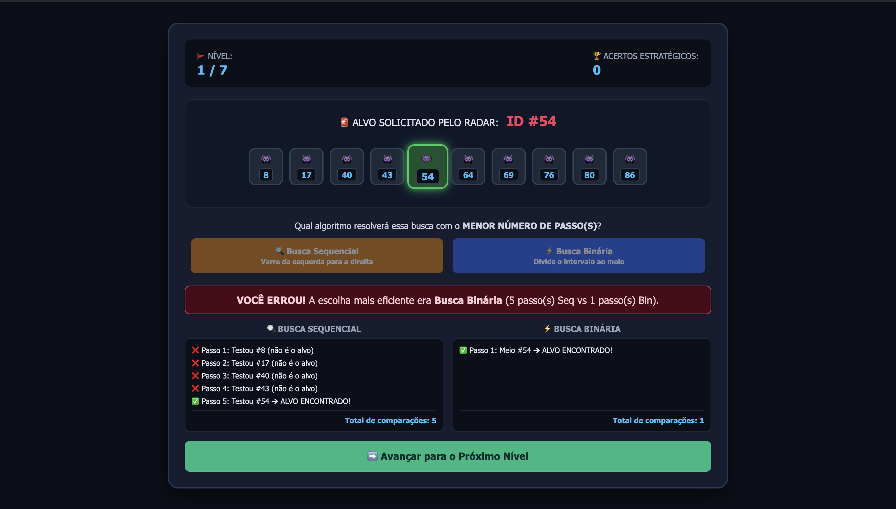
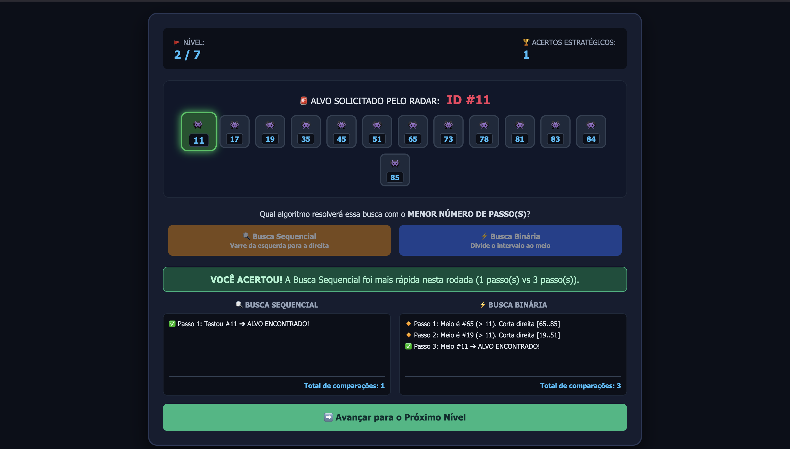

# G9_Busca_EDA2-2026.2

## Grupo 3
|Matrícula | Aluno |
| -- | -- |
| 22/1022720 | Rayene Ferreira Almeida |
| 21/1063013 | Renata Quadros Kurzawa  |

## Sobre 
Projeto interativo para comparar a busca sequencial e a busca binária em uma simulação visual. O objetivo é demonstrar, de forma prática, qual algoritmo encontra o alvo com menor número de passos, reforçando conceitos de eficiência e análise de algoritmos de busca sequencial e binária.

## Screenshots

  
   
  <em>Tela inicial</em>

 

  
   
  <em>Tela de Erro</em>

 

  
   
  <em>Tela de Acerto</em>

## Video

  

  <b>Autores:</b>
  <a href="https://github.com/rayenealmeida">Rayene Almeida</a> e 
  <a href="https://github.com/RenataKurzawa">Renata Quadros</a>

